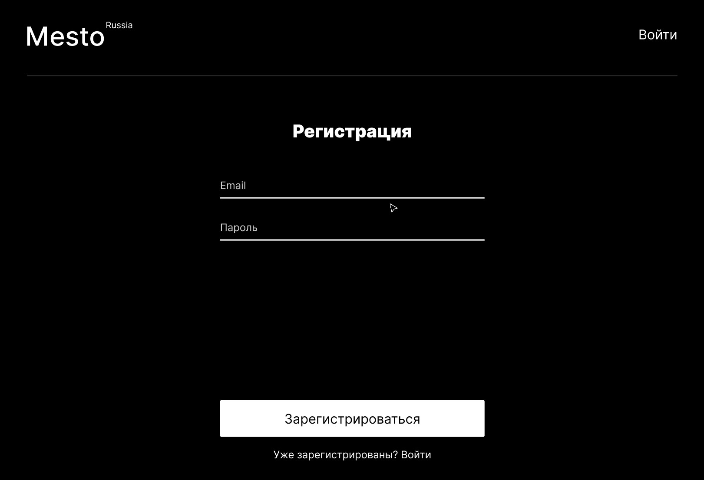

# Проект на Реакте с авторизацией и регистрацией

### _Учебный проект от [Яндекс.Практикум](https://practicum.yandex.ru/web/)_

## Описание проекта

##Проектное задание №12: _Регистрация и авторизация на «Реакт»_

#####_Проект посвящен интерактивному сервису **"Mesto"** и создан в рамках прохождения 4-12 спринтов курса *Веб-разработчик*. Учебный проект, выполняемый в рамках программы в **Яндекс.Практикум** по учебному курсу web-разработчик_. В этой части проекта реализован функционал написания логики регистрации и авторизации в проекте Mesto на «Реакте» _(Продолжение)_.

## Функционал:

- Созданы нужные роуты и опишисаны перенаправления;
- Верстка необходимых компонентов _(по данному макету https://www.figma.com/file/5H3gsn5lIGPwzBPby9jAOo/Sprint-14-RU?node-id=0%3A1)_
- Подключена основная функциональность сайта к бэкенду.
- Реализована аутентификация пользователя
- Реализована работа с локальным хранилищем и токеном

**Картинка и проекта**

## Ссылка:

# *https://zdarovzibrov.github.io/mesto/*

